# 🌌 Newton vs General Relativity — Gravity Simulation


<p align="center">
  
</p>


## 📝 Project Description

A side-by-side comparison of **Newtonian gravity** and **Einstein's General Relativity** (Schwarzschild metric), built from scratch in Python to *visualize* what each theory predicts on the same physical setup.

The project covers the four most pedagogical cases: **Mercury's perihelion precession** (the historical 1915 test), an **orbit around a stellar black hole** (strong-field regime, ISCO, plunge), the **deflection of light** (Eddington's 1919 eclipse experiment), and a **full N-body solar system** in Newtonian gravity.

This project was built **to actually understand** the differences — not just read about them. Each notebook validates the simulation against an analytical formula or a real observation (43"/century for Mercury, 1.75" for light bending, etc.).

---

## ⚙️ Features

  🪐 **Newton 2-body & N-body integrator** (`scipy.integrate.solve_ivp` with DOP853, event detection for periapses)

  ⚫ **Schwarzschild geodesics** via the **Binet-Einstein equation** in `u = 1/r` form, non-dimensionalized for numerical stability

  💡 **Photon trajectories** with exact treatment of the impact parameter `b`, capture detection at `b < (3√3/2)·rs`

  📓 **Four Jupyter notebooks** with theory, code, plots and interactive `ipywidgets` sliders

  🎮 **Pygame app** to switch Newton ↔ GR in real time with keyboard controls

  ✅ **Quantitatively validated**: Mercury precession measured at 42.998"/century vs 42.997" theory (0.002% error)

  📚 **SI units everywhere** — real planetary masses, real distances, real `c` and `G` — no toy normalizations

---

## Outputs

<p align="center">
  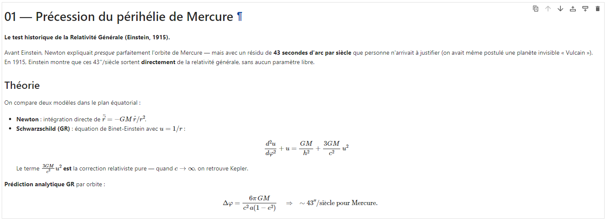
</p>

<p align="center">
  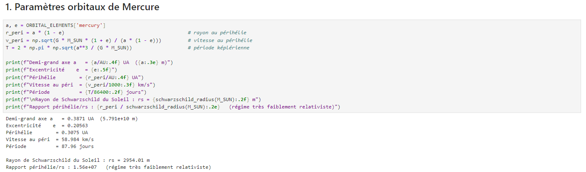
</p>

<p align="center">
  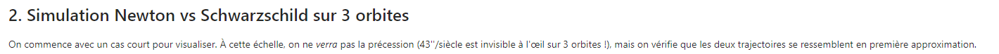
</p>

<p align="center">
  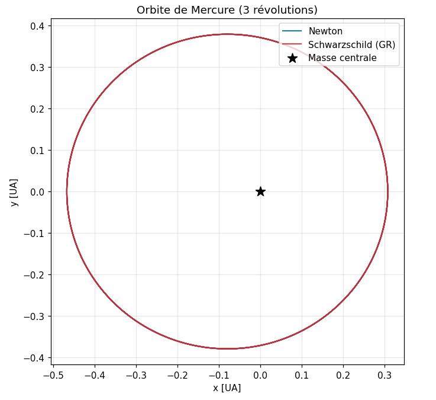
</p>

<p align="center">
  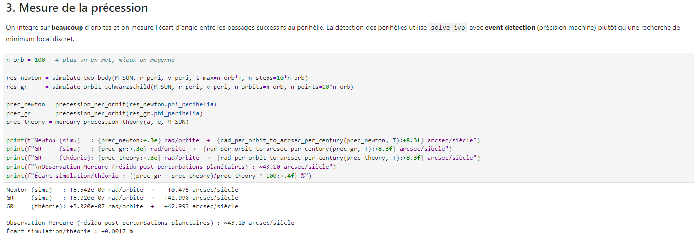
</p>

<p align="center">
  
</p>

<p align="center">
  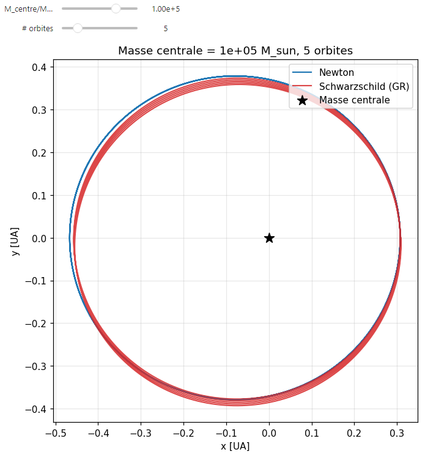
</p>

<p align="center">
  
</p>

<p align="center">
  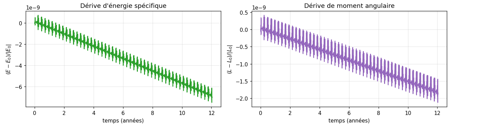
</p>

<p align="center">
  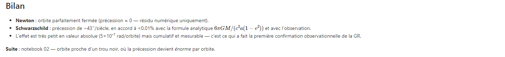
</p>

---

<p align="center">
  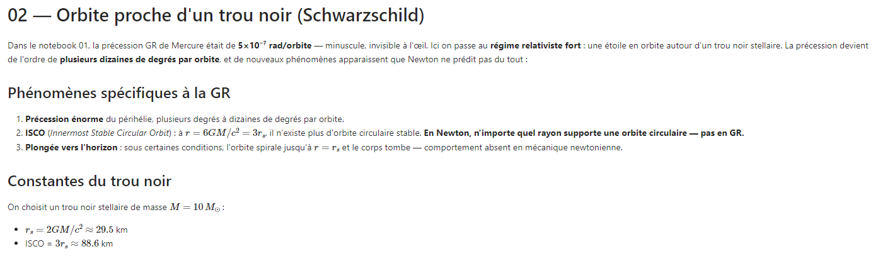
</p>

<p align="center">
  
</p>

<p align="center">
  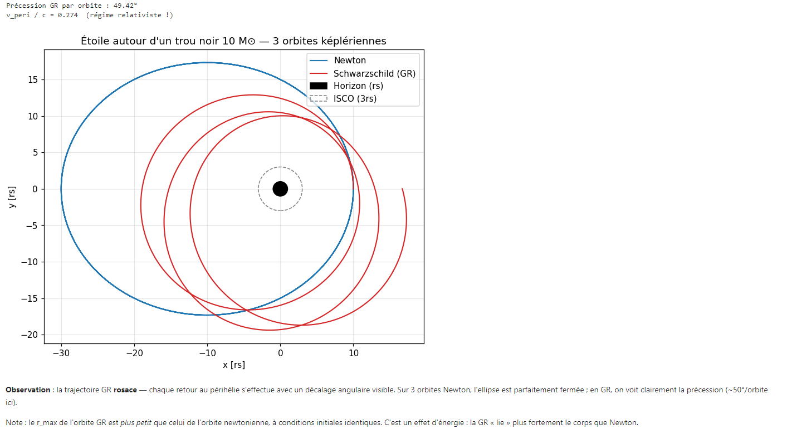
</p>

<p align="center">
  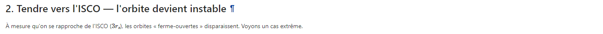
</p>

<p align="center">
  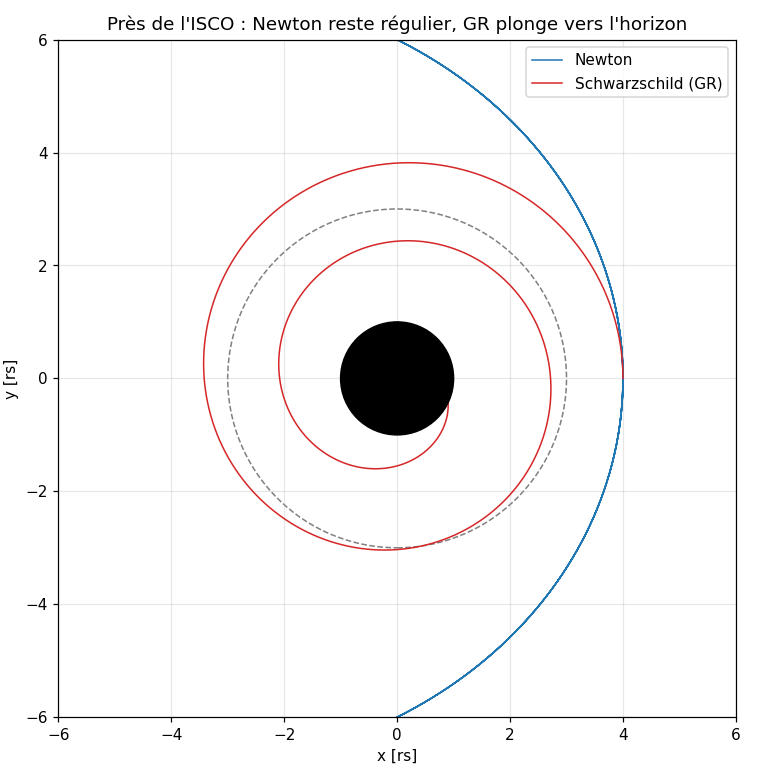
</p>

<p align="center">
  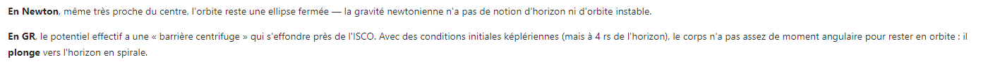
</p>

<p align="center">
  
</p>

<p align="center">
  
</p>

<p align="center">
  
</p>

<p align="center">
  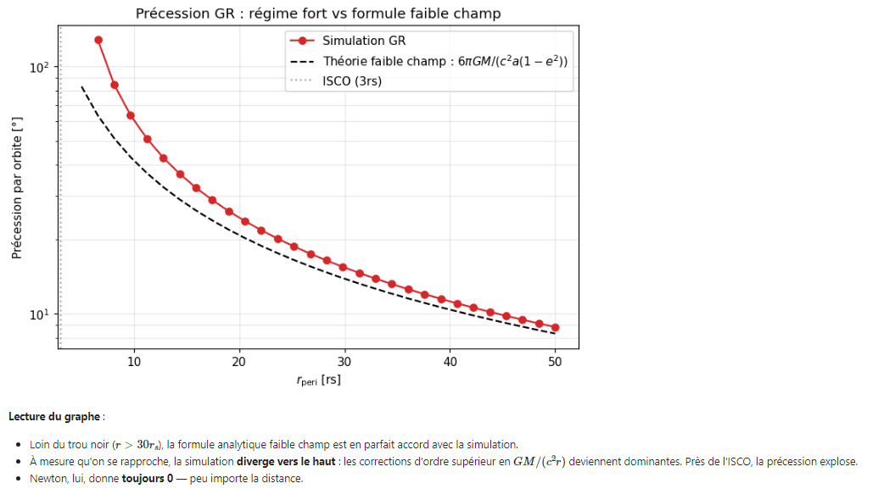
</p>

<p align="center">
  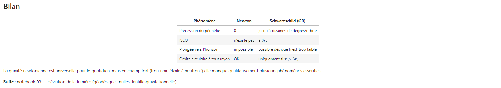
</p>

---

<p align="center">
  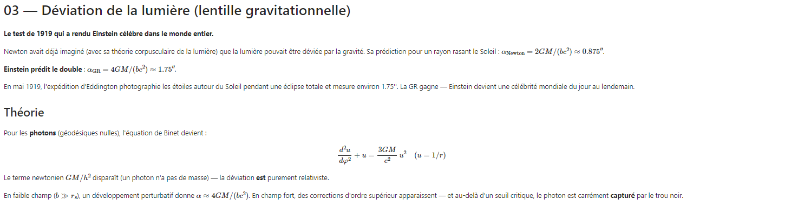
</p>

<p align="center">
  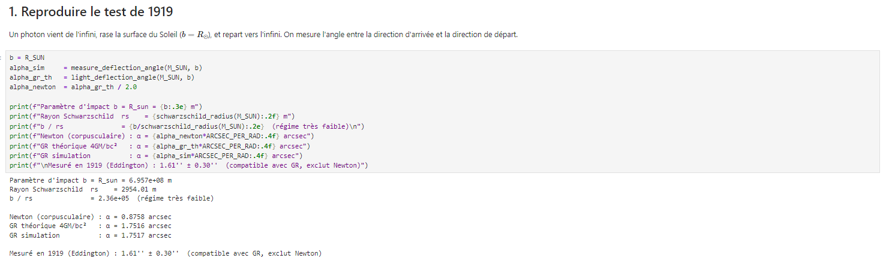
</p>

<p align="center">
  
</p>

<p align="center">
  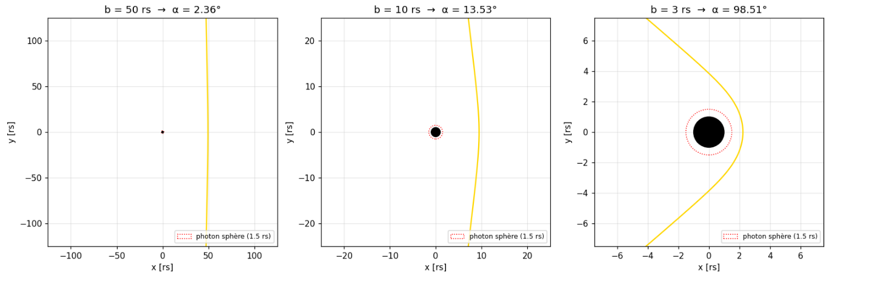
</p>

<p align="center">
  
</p>

<p align="center">
  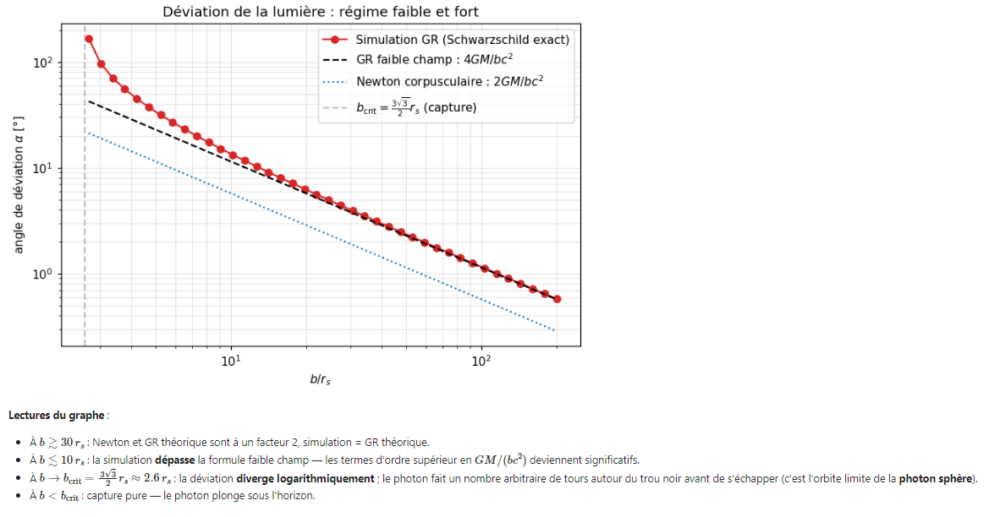
</p>

---

<p align="center">
  
</p>

<p align="center">
  
</p>

<p align="center">
  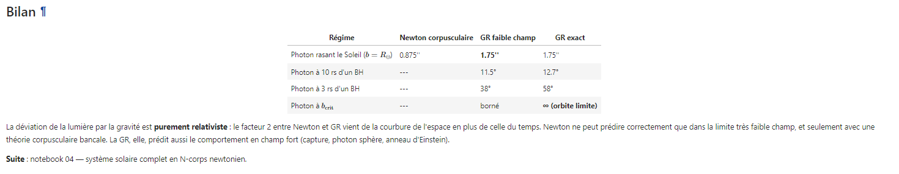
</p>

---

<p align="center">
  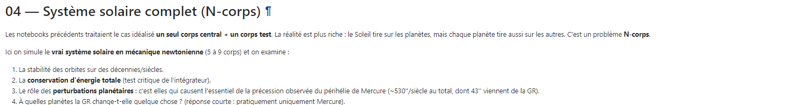
</p>

<p align="center">
  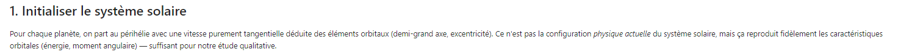
</p>

<p align="center">
  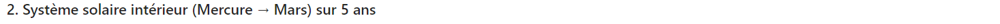
</p>

<p align="center">
  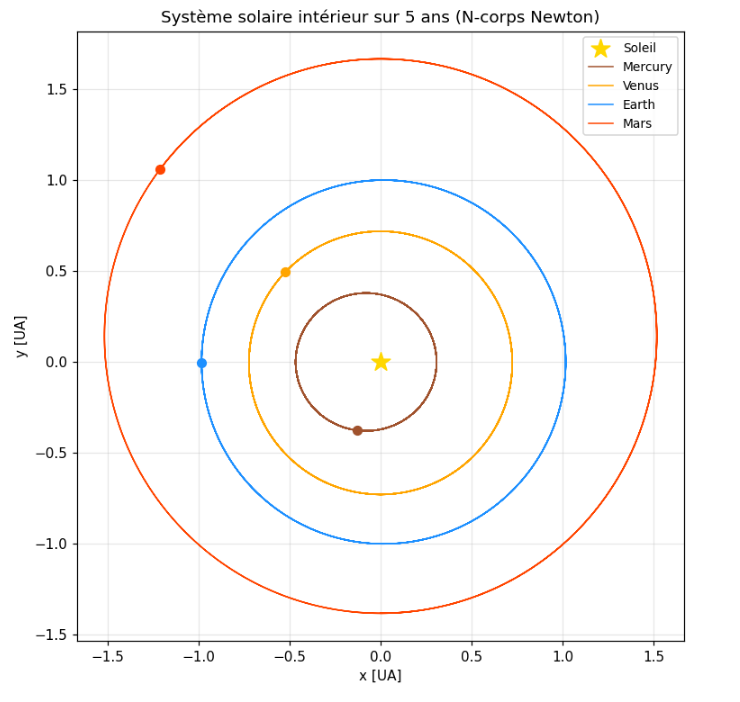
</p>

<p align="center">
  
</p>

<p align="center">
  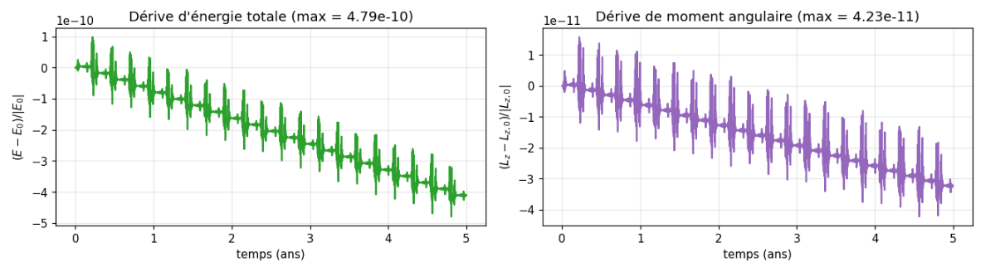
</p>

<p align="center">
  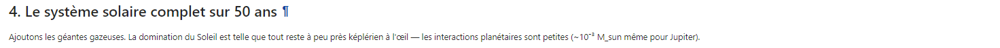
</p>

<p align="center">
  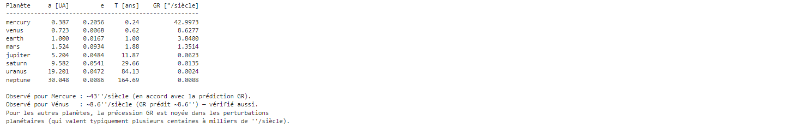
</p>

<p align="center">
  
</p>

<p align="center">
  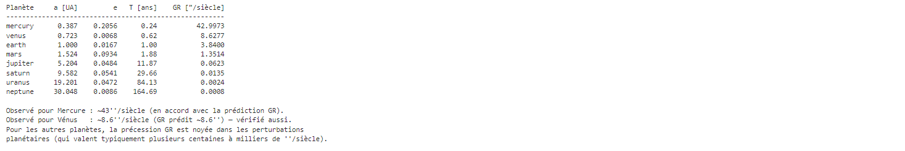
</p>

<p align="center">
  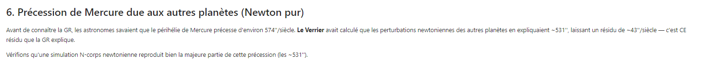
</p>

<p align="center">
  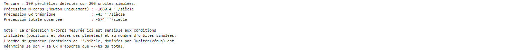
</p>

<p align="center">
  
</p>

<p align="center">
  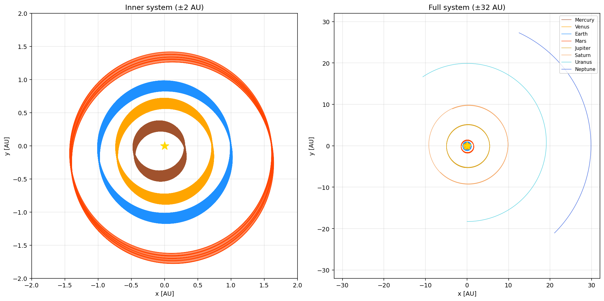
</p>

<p align="center">
  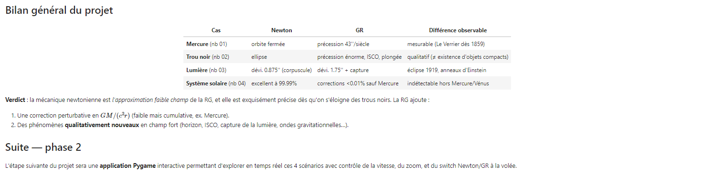
</p>

---

<p align="center">
  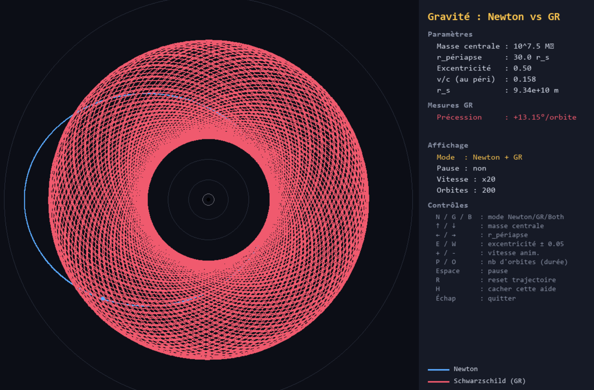
</p>

---

## ⚙️ How it works

  🧮 **Newton** integrates `d²r/dt² = -GM·r̂/r²` directly with high-order Runge-Kutta (DOP853). The 2-body and N-body solvers detect periapse passages via SciPy's event detection (`dr/dt = 0` with rising direction) for machine-precision precession measurements.

  🌀 **General Relativity** uses the **Binet-Einstein equation** for the spatial trajectory `u(φ) = 1/r`:
  - Massive particles: `d²u/dφ² + u = GM/h² + (3GM/c²)·u²`
  - Photons: `d²u/dφ² + u = (3GM/c²)·u²`

  The `(3GM/c²)·u²` term **is** the pure relativistic correction. As `c → ∞` we recover Kepler.

  🔢 **Non-dimensionalization**: integrating with `U = u·r₀` (initial condition `U(0) = 1`) keeps everything around unit scale, which is critical — for Mercury the natural `u ≈ 2×10⁻¹¹` is too close to numerical tolerances.

  🎯 **Photon impact parameter**: the app takes the asymptotic `b` (standard), converts it internally to the closest approach `r_min` via the cubic `r_min³ - b²·r_min + b²·rs = 0`, and raises if `b < b_crit = (3√3/2)·rs` (photon captured).

  📊 **Validation**: each scenario is checked against an analytical formula (`6πGM/(c²·a(1-e²))` for Mercury, `4GM/(bc²)` for light, total energy conservation for N-body) or against a known observation.

---

## 📂 Repository structure

```bash
├── assets/                            # Images & GIFs for the README
│
├── notebooks/
│   ├── 01_mercury_precession.ipynb    # The 1915 historical test
│   ├── 02_black_hole_orbit.ipynb      # Strong field, ISCO, plunge
│   ├── 03_light_deflection.ipynb      # 1919 eclipse, lensing
│   └── 04_solar_system.ipynb          # N-body Newton
│
├── src/
│   ├── config.py                      # Physical constants (G, c, M_sun, ...)
│   ├── utils.py                       # Precession measurement, unit conversions
│   │
│   ├── newtonian/
│   │   └── nbody.py                   # 2-body + N-body integrator
│   │
│   ├── relativity/
│   │   └── schwarzschild.py           # Binet-Einstein: massive & photon
│   │
│   └── visualization/
│       ├── plots.py                   # Matplotlib helpers
│       └── pygame_app.py              # Real-time Newton/GR switcher
│
├── run_pygame.py                      # Entry point for the interactive app
│
├── requirements.txt
├── CLAUDE.md                          # Technical specs & physics notes
├── LICENSE
└── README.md
```

---

## 💻 Run it on Your PC

Clone the repository and install dependencies:
```bash
git clone https://github.com/Thibault-GAREL/simulation_gravity-general_relativity.git
cd simulation_gravity-general_relativity

python -m venv .venv # if you don't have a virtual environment
source .venv/bin/activate   # Linux / macOS
.venv\Scripts\activate      # Windows

pip install numpy scipy matplotlib jupyter ipywidgets pygame
```

### Run the Jupyter notebooks
```bash
jupyter lab
```
Then open any notebook in the `notebooks/` folder. Start with `01_mercury_precession.ipynb`.

### Launch the interactive Pygame app
```bash
python run_pygame.py
```

**Controls:**
- `N` / `G` / `B` — show Newton / GR / Both
- `↑` `↓` — central mass (×√10 per step)
- `←` `→` — periapse in Schwarzschild radii
- `E` / `W` — eccentricity ±0.05
- `P` / `O` — number of pre-computed orbits (longer loop)
- `+` / `-` — animation speed
- `Space` — pause   |  `R` — reset trail   |  `H` — toggle help   |  `Esc` — quit

---

## 📖 Inspiration / Sources

I built this project to actually understand what changes between Newton and Einstein when you point a numerical solver at the same problem 😆 !

I read 2 **books** about Newton and Einstein, and that's what motivated me to translate what I read into a Python simulation.

I used Claude AI for sanity-checking the Binet-Einstein derivation and helping with the non-dimensionalization that made Mercury's precession numerically tractable.

Code created by me 😎, Thibault GAREL - [Github](https://github.com/Thibault-GAREL)
